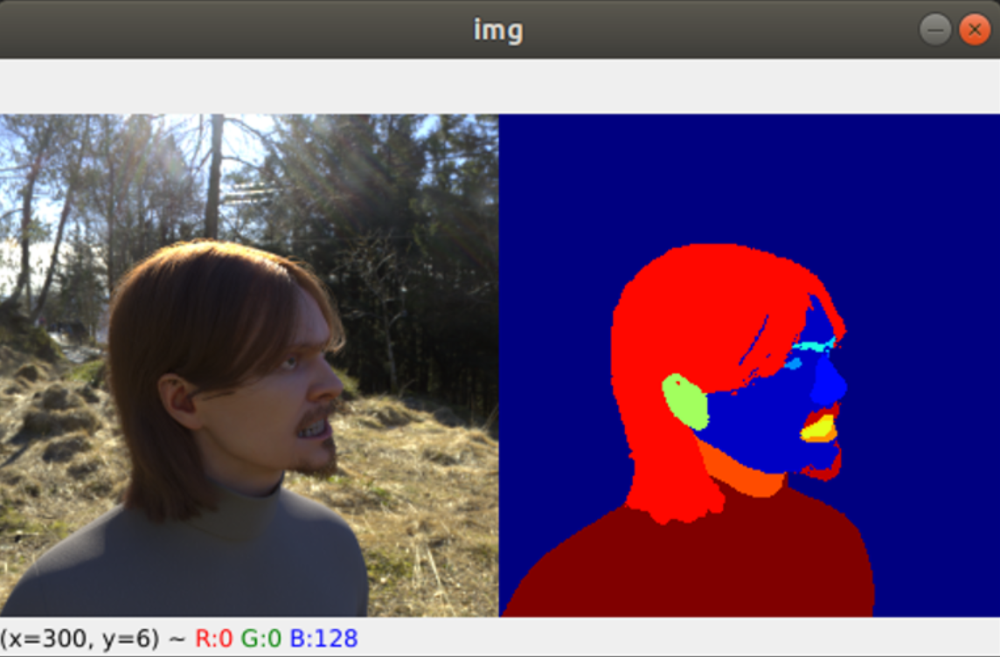

## Readme

1. **Visualize Mask R-CNN outputs** and verify if the model outputs are correct. Inside your experiment
folder, run `collect_metrics.py --help` to see the command line args. The `--show` option visualizes
the results, for example:
    ```
    python collect_metrics.py --input d:\datasets\FaceSynthetics --output .\Results --show
    ```
    You should see something like this:

    

1. **Compute metrics**. Inside your experiment folder, run `collect_metrics.py` again without the
`--show` argument and you will get a .csv output file listing the F1 scores for each category and an
overall score.
