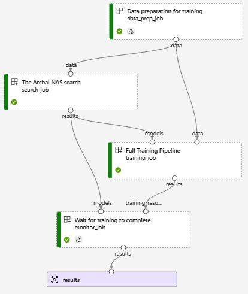
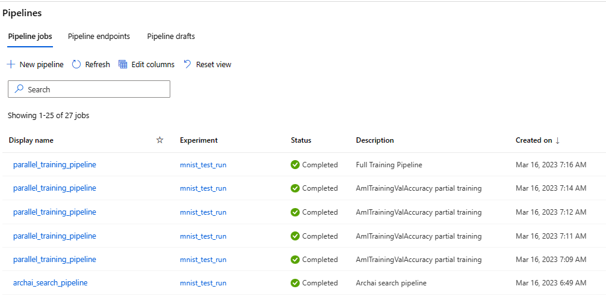

# Distributed Search

This sample shows how to use an `AsyncModelEvaluator` named `AmlTrainingValAccuracy` to do some
partial distributed training using [Azure ML pipelines](https://learn.microsoft.com/en-us/azure/machine-learning/tutorial-pipeline-python-sdk) during the Archai search using an `EvolutionParetoSearch`
and a sample `CNNSearchSpace` designed to find a good model that works on the `MNIST` dataset.

The [distributed_search](distributed_search.ipynb) notebook uses an Azure storage account that you
provide and an Azure ML workspace.  The Azure storage account will accumulate results while the
search is in progress.

The notebook first kicks off the master search pipeline which will look like this:



The data prep component simply copies the MNIST dataset to a pipeline blob store for use as input
not only on this search job but also in all the partial training jobs to come.

The `EvolutionParetoSearch` will do 5 iterations, and during that time it will kick off one new AML
pipeline for each iteration that will train the batch of models that the `AmlTrainingValAccuracy`
needs to get validation accuracy numbers for.  You can get the log output of the search job by
looking at the "Outputs + logs" in the Azure Machine Learning Studio.

For example, the following partial training pipeline was created to do partial training of 36 models in a GPU cluster:


Azure ML automatically keeps the GPU cluster busy feeding all the models until they are all trained.
In this case we create an 8 node GPU cluster, and so you will see the jobs completing in batches of 8.

You can see all the pipelines created dynamically by the search using your Azure ML Pipelines
dashboard. Here you see 5 iterations followed by a final full training job:



You can also run the cell titled `Plots` in the notebook multiple times to watch how the pareto curves are
shaping up, you will see something like this after 5 iterations have completed:


When the search is finished you will see this output in the log showing the top models

```json
Top model results:
{
  "init_num_models": 10,
  "partial_training_epochs": 1,
  "full_training_epochs": 10,
  "id_bc52a6ee_4ef2_4327_8c8c_3bba2165c3ea": {
    "archid": "(1, 3, 32)",
    "val_acc": 0.3953
  },
  "id_1250cb3f_0fc9_4cad_a4f2_e627db5c66e8": {
    "archid": "(1, 1, 32)",
    "val_acc": 0.2237
  },
```

And the next cell in the notebook will download this file named 'models.json'.

You can run the last cell of the notebook to compare the inference accuracy of the top
model using the ONNX runtime locally on the resulting downloaded .onnx model.

You should see something like this:

```
Inference pass rate is  99.57 %.
How does this compare with the training validation accuracy of 0.9957
```

## Design

So how does all this work.  The overall architecture looks like this:


Where the main search pipeline launches [search.py](scripts/search.py) script on a cheap CPU virtual
machine since it doesn't need much horse power.  This search pipeline starts with a quick data-prep
step to ensure our dataset is in a shared Azure blob store, then it does the Archai search.  When
the search is complete we have a `pareto.json` file containing the id's of the best models, and we
then kick off a full training run for those models using a `dynamic_graph` node in the search
pipeline.

This `search.py` script plugs the [aml_training_evaluator.py](scripts/aml_training_evaluator.py)
into the `EvolutionParetoSearch` objectives, and the `AmlTrainingValAccuracy` is an
`AsyncModelEvaluator` meaning that the search algorithm calls `send` to pass all the models in the
current iteration then it calls `fetch_all` to get the results.

So it is the `fetch_all` method then that creates a new AML pipeline for that iteration,
dynamically adding a partial training job for each model, each one of those commands
invokes [train.py](scripts/train.py).

But how does each partial training job send results back to the master search pipeline
you might ask?  Great question, I'm glad you asked.  The training jobs are given access
to the azure storage account where there is a `status` table that they write to.

You can look at this status table to get a great idea of what is going on:


Here you can see some models are still `training` and some are completed: `trained`.
You can also see what the model architecture is for each one. When a job is finished
it will have a published `val_acc` column containing the validation accuracy reported
by the partial training.

The `AmlTrainingValAccuracy` evaluator collects these numbers and returns them to the
search algorithm which will use them to select the best models to iterate on.
