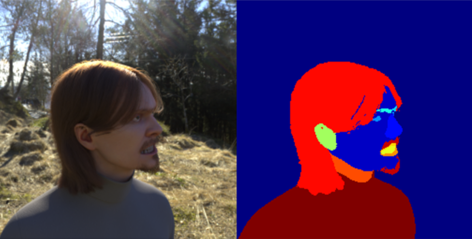
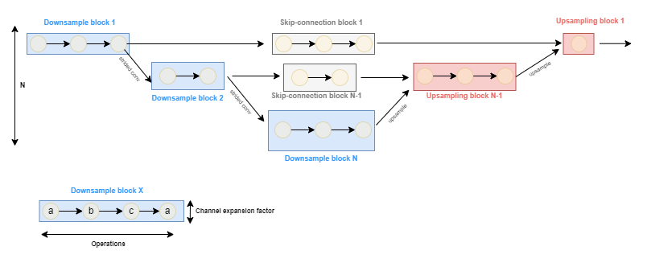
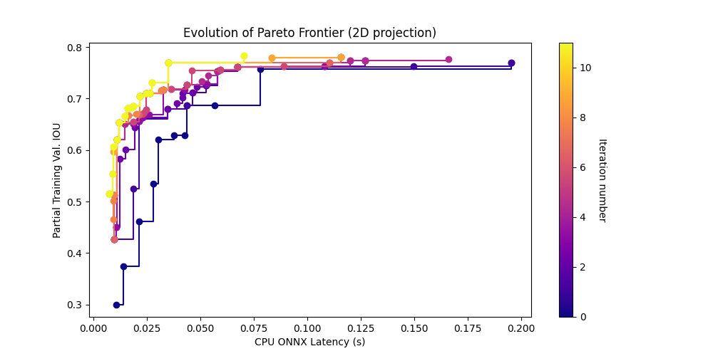
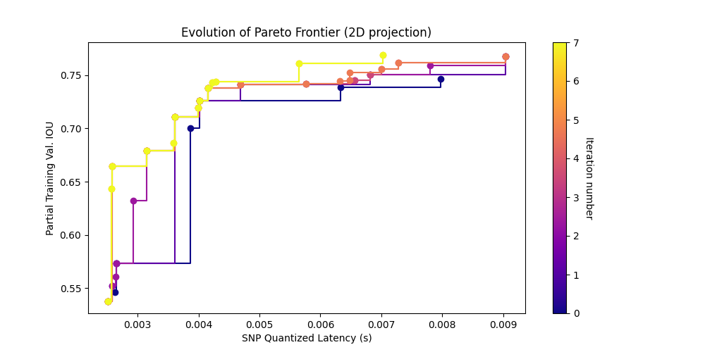

# Face Segmentation

The purpose of this example/tutorial is to demonstrate how to perform multi-objective NAS for image segmentation models using Archai. This approach allows us to optimize the model's performance with respect to multiple objectives, such as Intersection Over Union (IOU) and inference time for various deployment targets. Specifically, we will focus on performing the search for both regular CPU targets and Qualcomm's Snapdragon processor, enabling us to optimize the models for deployment on mobile devices as well.

## Dataset

We will use the Face Synthetics dataset for this example. The dataset comprises 100,000 512x512 synthetic face images, each annotated with 19 per-pixel semantic segmentation labels. These labels cover various aspects of the face, including background, skin, eyes, ears, nose, lips, clothing, and headwear.



## Search Space

The search space used for this example is based on the [Stacked HourglassNet architecture](https://arxiv.org/abs/1603.06937). The search space consists in 3 different block types: `downsample`, `upsample` and `skip`, with each block type containing one or more possible operations. Additionally, `downsample` blocks also control the number of channels.



## Neural Architecture Search

To run a search job, use the following command

```shell
python3 search.py --dataset_dir [face_synthetics_dir] --output_dir [output_dir] --search_config [search_config_file]
```

Use `--search_config` to specify the search config file with the desired search settings. We provide two basic search configurations based on the desired target (CPU or Snapdragon processor), `search.py` will use [cpu_search.yaml](confs/cpu_search.yaml) if no search config file is passed.

* [cpu_search.yaml](confs/cpu_search.yaml)
* [snp_search.yaml](confs/snp_search.yaml)

Note: to use `snp_search.yaml` you will need to follow the [SNP setup instructions](#).

By default, `search.py` will run multiple partial training jobs using Ray (2 jobs per GPU). To change the number of gpus per job, set `--gpus_per_job`, or use the `--serial_training` flag to disable parallel training jobs altogether.

The pareto architecture files selected by the search algorithm can be found under `[output_dir]/pareto_models_iter_XX`. A table with the partial training performance and other objectives can be found in the `[output_dir]/search_state_XX.csv` file.

## Final Training

To fully train one of the selected architectures by the NAS algorithm use the following command

```shell
python3 train.py [path_to_final_architecture.json] --dataset_dir [face_synthetics_dir] --output_dir [output_dir] --epochs [n_epochs]
```

## NAS Results (CPU Target)

### Search



The selected architectures for the search with the `cpu_search.yaml` config file can be found in the [archs/cpu_target/](arch/cpu_target/) directory or in the table below.

### Final Training

The table below shows the final results after fully training the final pareto architectures for 30 epochs using the [train.py](./train.py) script.

| Architecture                                                                                    |   Search iteration   |   ONNX Latency (s)   |   Full training Validation mIOU |
|:------------------------------------------------------------------------------------------------|---------------------:|---------------------:|--------------------------------:|
| [d650d48bdc83e75ae6ace9f20c17caa65fb5048a](archs/cpu_target/d650d48bdc83e75ae6ace9f20c17caa65fb5048a.json) |   9                  |                0.070 |                            0.88 |
| [07d670b8f76d8b9ca1e39379798d8b0046695b6a](archs/cpu_target/07d670b8f76d8b9ca1e39379798d8b0046695b6a.json) |   6                  |                0.035 |                            0.87 |
| [0cf2105627cd8ef8b86bdafd4987714dc2519827](archs/cpu_target/0cf2105627cd8ef8b86bdafd4987714dc2519827.json) |   8                  |                0.027 |                            0.85 |
| [1531903d654ecc930a0659e31b42c3efe6fe6ef3](archs/cpu_target/1531903d654ecc930a0659e31b42c3efe6fe6ef3.json) |   6                  |                0.022 |                            0.85 |
| [f22f089ae8c618117f4869f20213b344189bab9a](archs/cpu_target/f22f089ae8c618117f4869f20213b344189bab9a.json) |   4                  |                0.025 |                            0.84 |
| [b049ce7b41268d956af5410a3e838a2992d29232](archs/cpu_target/b049ce7b41268d956af5410a3e838a2992d29232.json) |   4                  |                0.026 |                            0.84 |
| [31cc57fe423f06a0f4d6ba000fe1e3decd3a442c](archs/cpu_target/31cc57fe423f06a0f4d6ba000fe1e3decd3a442c.json) |   8                  |                0.019 |                            0.84 |
| [1f1a7d04c4925d17f0575418cc974327ab71a93a](archs/cpu_target/1f1a7d04c4925d17f0575418cc974327ab71a93a.json) |   8                  |                0.015 |                            0.83 |
| [0c74d6d48a3514be3e80a84593c5f6b3f656fb3c](archs/cpu_target/0c74d6d48a3514be3e80a84593c5f6b3f656fb3c.json) |   8                  |                0.016 |                            0.82 |
| [1ab34d5fb31ef986650b5b112cfa3eca104b8107](archs/cpu_target/1ab34d5fb31ef986650b5b112cfa3eca104b8107.json) |   8                  |                0.018 |                            0.82 |
| [e6b8640bd2b83212e3256907a2382ae9bb799b65](archs/cpu_target/e6b8640bd2b83212e3256907a2382ae9bb799b65.json) |   5                  |                0.012 |                            0.82 |
| [82419a2ad358a34c508444c86db261616cf45ec3](archs/cpu_target/82419a2ad358a34c508444c86db261616cf45ec3.json) |   3                  |                0.011 |                            0.81 |
| [15914e86631373b2d9c823873ba6a88a1dc548c7](archs/cpu_target/15914e86631373b2d9c823873ba6a88a1dc548c7.json) |   9                  |                0.010 |                            0.77 |
| [de9067fa95074057353c67f62036a5b395a2d6a2](archs/cpu_target/de9067fa95074057353c67f62036a5b395a2d6a2.json) |   8                  |                0.009 |                            0.76 |
| [be543f6a3d1eadc9a42496f0b40871d82d4931df](archs/cpu_target/be543f6a3d1eadc9a42496f0b40871d82d4931df.json) |   8                  |                0.007 |                            0.73 |


## NAS Results (Snapdragon Target)

### Search



The selected architectures for the search with the `snp_search.yaml` config file can be found in the [archs/snp_target/](arch/snp_target/) directory or in the table below.
| Architecture                                                                          |   Search iteration |   SNP Quantized Latency (s) |   Partial Training Val. IOU |
|:-----------------------------------------------------------------------------------------------------------|----------------:|----------------------------:|----------------------------:|
| [69f28a4c45aef58a67e2e2e0ce2d087b60b03173](archs/snp_target/69f28a4c45aef58a67e2e2e0ce2d087b60b03173.json) |              12 |                       0.008 |                       0.783 |
| [b14a1f0a3d17ea0f62022c2cf61da032fd7c9971](archs/snp_target/b14a1f0a3d17ea0f62022c2cf61da032fd7c9971.json) |               5 |                       0.007 |                       0.769 |
| [946fb0e27ef6ab9659b128006697a1b5a90e674c](archs/snp_target/946fb0e27ef6ab9659b128006697a1b5a90e674c.json) |              13 |                       0.007 |                       0.768 |
| [7bd6a76ec04e9f85c27d69a48557f689b0af2037](archs/snp_target/7bd6a76ec04e9f85c27d69a48557f689b0af2037.json) |               5 |                       0.006 |                       0.761 |
| [fb5511d6bee3bf52abed1527850c829cc4293098](archs/snp_target/fb5511d6bee3bf52abed1527850c829cc4293098.json) |               7 |                       0.005 |                       0.758 |
| [4fca939c89bf725f9efa47606c640e302f8ae9cc](archs/snp_target/4fca939c89bf725f9efa47606c640e302f8ae9cc.json) |              10 |                       0.004 |                       0.752 |
| [0ef9945b08c953586848a8507bc5d057fab7278d](archs/snp_target/0ef9945b08c953586848a8507bc5d057fab7278d.json) |              14 |                       0.004 |                       0.749 |
| [d47fc530a155c9c182773fc918fc3f17ed27a9d5](archs/snp_target/d47fc530a155c9c182773fc918fc3f17ed27a9d5.json) |              13 |                       0.003 |                       0.712 |
| [2aa378e5fad84ecc2114f8855a2cd8b02658cbdc](archs/snp_target/2aa378e5fad84ecc2114f8855a2cd8b02658cbdc.json) |              14 |                       0.003 |                       0.709 |
| [81f407d6f62de129e917c6b4f58021143a5df050](archs/snp_target/81f407d6f62de129e917c6b4f58021143a5df050.json) |               7 |                       0.003 |                       0.703 |
| [a223144f3b12adf3144478e5060bd99ef2a64ae9](archs/snp_target/a223144f3b12adf3144478e5060bd99ef2a64ae9.json) |              13 |                       0.003 |                       0.693 |
| [206e6e499eca01389b46c46989588ff04a2f3a42](archs/snp_target/206e6e499eca01389b46c46989588ff04a2f3a42.json) |              14 |                       0.003 |                       0.688 |
| [115fc8c962797a6dfd9c3f24fd5ccb4b60df95df](archs/snp_target/115fc8c962797a6dfd9c3f24fd5ccb4b60df95df.json) |              10 |                       0.003 |                       0.682 |
| [230f1fe115fac89432f5bccad7a01c65e3bb2918](archs/snp_target/230f1fe115fac89432f5bccad7a01c65e3bb2918.json) |              10 |                       0.003 |                       0.666 |
| [78c76774f378e083c788e56e86978f6d1d9f267c](archs/snp_target/78c76774f378e083c788e56e86978f6d1d9f267c.json) |              10 |                       0.003 |                       0.659 |
| [604ee54bcc767722bbdd3a610246aadca5a32214](archs/snp_target/604ee54bcc767722bbdd3a610246aadca5a32214.json) |              11 |                       0.003 |                       0.657 |
| [c570e333fd94f2d514eb1955fafc9eeeb012e750](archs/snp_target/c570e333fd94f2d514eb1955fafc9eeeb012e750.json) |               9 |                       0.003 |                       0.636 |
| [4786c03a18be281ad2fed235c86a5fe952fb4b0a](archs/snp_target/4786c03a18be281ad2fed235c86a5fe952fb4b0a.json) |               9 |                       0.002 |                       0.562 |

