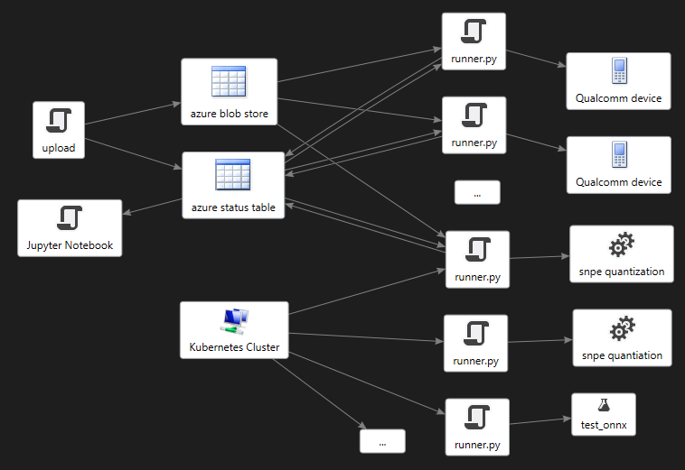

# Readme

See Demo Video:

 

This folder contains code that automates the search, partial training and inference latency testing in [Azure
ML](https://azure.microsoft.com/en-us/products/machine-learning/). The inference testing of ONNX models can be performed
across one or more machines that are connected via USB to Qualcomm 888 boards.

The code is organized into:

1. [Training](training/readme.md) code that plugs into the Archai Search to perform partial training
of selected models on a GPU cluster in Azure ML.

1. [SNPE Device](snpe/readme.md) code that uses [Microsoft
Olive](https://github.com/microsoft/olive) to drive the
[Qualcomm Neural Processing SDK](https://developer.qualcomm.com/software/qualcomm-neural-processing-sdk) to talk
to the device, convert ONNX models to .dlc, quantize them, and test them on one or more
[Qualcomm 888 dev kits](https://developer.qualcomm.com/hardware/snapdragon-888-hdk).

1. [Azure Code](azure/readme.md) that talks to a configured Azure storage account for uploading
models to test, downloading them, uploading test results, and keeping an Azure status table that
summarizes results of all the work in progress.

1. [Docker](docker/quantizer/readme.md) contains scripts for setting up your Azure account and optionally
creating a docker image for running in an Azure Kubernetes cluster to do model quantization using
the Qualcomm Neural Processing SDK. Quantization is time consuming so having an elastic scale speeds
things up a lot.

1. [Notebook](notebooks/results.ipynb) a simple Jupyter notebook for visualizing the
results found in your Azure table.

## Results

The jupyter notebook can be used to visualize the results of the search iterations as they are
happening.  The following is a an animation of the complete 20 search iterations where the darker
colors are the early iterations and the brighter colors are the most recent iterations. The pareto
frontier models are highlighted in yellow. This clearly shows the general trend of model improvement
over time on each new iteration.

The following animation shows only the pareto models from each search iteration. These are the
models that get mutated during the evolutionary pareto search, all the other models have lower
validation scores and are discarded:

When the search completes you can run [train_pareto.py](../../train_pareto.py) to fully train the
pareto models. When training is finished you can visualize the results of full training in the notebook and you should see something like this:

Then you can run [snp_test.py](../../snp_test.py) to compute the F1 scores for these fully trained
models on your Qualcomm hardware, the following is a plot you can get from the notebook showing the
final results comparing F1 accuracy with inference latency.  Notice that the Qualcomm hardware F1
score mostly matches our earlier `val_iou` pareto curve, but not exactly. The dots shown in gray
have fallen off the pareto frontier. This is why it is always good to test your models on the target
hardware.  Even better if that testing can be done in the search loop so that the search finds
models that work well on the target hardware, as we have done in this face segmentation example:

## Workflow

The overall workflow begins with the top level [aml.py](../../aml.py) script which starts with an
Archai Search that contains an `AmlPartialTrainingEvaluator` and a `RemoteAzureBenchmarkEvaluator`.
The remote benchmark evaluator performs inference latency testing on Qualcomm hardware.  The
`AmlPartialTrainingEvaluator` then kicks off one new Azure ML training pipeline for each batch of
new model architectures that need to be partially trained, it stores the validation IOU results in
an Azure blob store and an Azure table so the search can get those results and use them to figure
out the next iteration of the search algorithm:

See [AML Training Readme](training/readme.md) for more information.

## Remote Inference Testing

The remote inference testing workflow looks like this, the `RemoteAzureBenchmarkEvaluator` uploads
models to the same Azure blob store, and adds a row to the status table.  This triggers remote
instances of the [runner.py](azure/runner.py) script to process these new models on an attached
Qualcomm device.  Optionally some of the work can be done in the cloud using a Kubernetes cluster,
this includes model quantization and accuracy testing using the ONNX runtime. The workflow looks
like this:

Each instance of `runner.py` looks for work, and executes it in priority order where the
prioritization is defined by the `find_work_prioritized` function in the runner.  This script is
completely restartable, and can distribute the work across multiple instances of the runner script.
Each instance will pick up where a previous one left off based on what it finds in your Azure status
table. The prioritization maps to the columns of the status table as follows:

1. **macs:** convert to .dlc and post Macs score and `snpe-dlc-viewer` output and do model quantization (runs on Linux) - priority 20
1. **total_inference_avg** run `snpe_bench.py` with quantized model on Qualcomm device DSP - priority 30
1. **f1_onnx** compute f1 from onnxruntime on .onnx model on a 10k test set on Linux - priority 60
1. **f1_1k** compute f1 on quantized .dlc model on Qualcomm device DSP with a 1k test set - priority
is the mean f1 score so that quicker models are prioritized.
1. **f1_1k_f** compute f1 on floating point .dlc model on on Qualcomm device CPU with a 1k test set
   - priority 10 * the mean f1 score so that quicker models are prioritized.
1. **f1_10k** compute f1 on quantized model on a 10k test set - priority = 100 * the mean f1 score
   so that quicker models are prioritized.

Lower number means higher priority job and each machine will run the highest priority work first.

You can override the priority of a specific job by passing a `--proprity` parameter on the `upload.py` script or by
editing the Azure status table and adding a `priority` field to the JSON stored there. You can set any priority number
you want, if you specify priority 0 it will run before anything else which can be handy if you have a cool new model
that you want to bump to the top of the list.

Notice some of the above jobs can run on Linux and do not require Qualcomm device. So in order to maximize throughput on
machines that do have a Qualcomm devices you can allocate other Linux machines with no Qualcomm devices to do the other
work, namely, converting models, quantizing them, and running the `f1_onnx` test.

Folks across your team can use the `azure/upload.py` to submit jobs and let them run, or they can automate that as
shown in the `RemoteAzureBenchmarkEvaluator` in the `search.py` script.

You can use `status.py` to monitor progress or look at the Azure status table.  Various status messages are posted
there so you can see which machine is doing what and is in what stage of the job.

Next you can go to the `notebook` page and get some pretty pictures of your Pareto Curves.

## Azure Portal

When everything is running you will see progress happening in your Azure status table.  Here you see the snpe-quantizer
kubernetes cluster is quantizing a bunch of models while other machines are running the bench mark tests on the Qualcomm
hardware:

