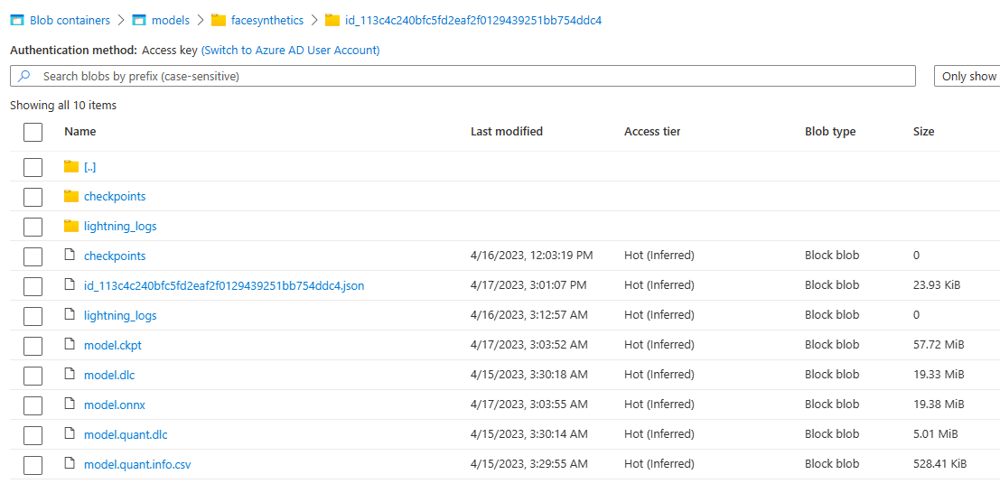

## AML Training Readme

Two scripts in this folder provide Azure ML training pipelines to the Archai Search.
The [train.py](../../train.py) script plugs in the `AmlPartialTrainingEvaluator`
async model evaluator when invoked with the [aml_search.yaml](../../confs/aml_search.yaml) configuration.

The top level [aml.py](../../aml.py) script kicks off this process setting up all the
required Azure ML resources including:
- a conda environment used to build the docker image that Azure ML uses
- a cpu cluster for running the search
- a gpu cluster for running partial training
- the datastore for the training dataset
- the datastore for downloading config info and uploading results, including the trained models

Notice that the [aml_search.yaml](../../confs/aml_search.yaml) configuration
file requires the following environment variables be defined so that it can find your Azure subscription,
and Azure ML resource group and workspace, it also needs the connection string for your storage account.

```yaml
aml:
  connection_str: ${MODEL_STORAGE_CONNECTION_STRING}
  subscription_id: ${AZURE_SUBSCRIPTION_ID}
  resource_group: ${AML_RESOURCE_GROUP}
  workspace_name: ${AML_WORKSPACE_NAME}
```

The storage account can be created using the [setup.ps1](../docker/quantizer/setup.ps1) powershell script
which uses the [Azure CLI](https://learn.microsoft.com/en-us/cli/azure/install-azure-cli).

[aml_training_evaluator](aml_training_evaluator.py) provides a class named
`AmlPartialTrainingEvaluator` which is an `AsyncModelEvaluator` that creates a new Azure ML Pipeline
for partial training each new batch of models provided by the Archai Search algorithm.  It runs these partial
training jobs on a GPU cluster to maximize throughput.

[training_pipeline](training_pipeline.py) provides a helper function named `start_training_pipeline`
that uses the Azure ML Python SDK to create the Azure ML training pipeline.

As the search progresses and training is completed you will find the following files in your
Azure storage account:



The name of this folder is the model id, `id_113c4c240bfc5fd2eaf2f0129439251bb754ddc4` which can also
be found in your Azure storage table.  The parent folder `facesynthetics` is the `experiment name` and is also
the name of your Azure storage table. This table contains the overall summary for all the models processed so far.

You can see here that Qualcomm Snapdragon processing was also done on this model, so you see the [.dlc
files](https://developer.qualcomm.com/sites/default/files/docs/snpe/overview.html) there for the model and for the
quantized version of the model and a `.csv` file containing information about inference times for this model (including
layer by layer information which is handy).

The json file contains the `ArchConfig` for the model which can be used to recreate the model
and fully train it using the [train.py](../../train.py) script.