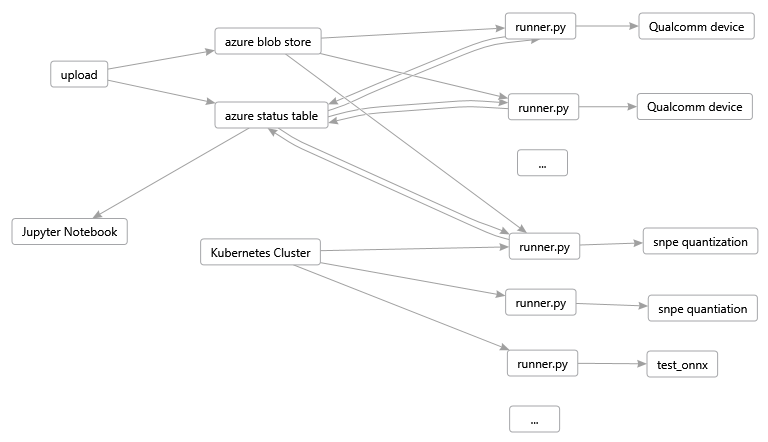
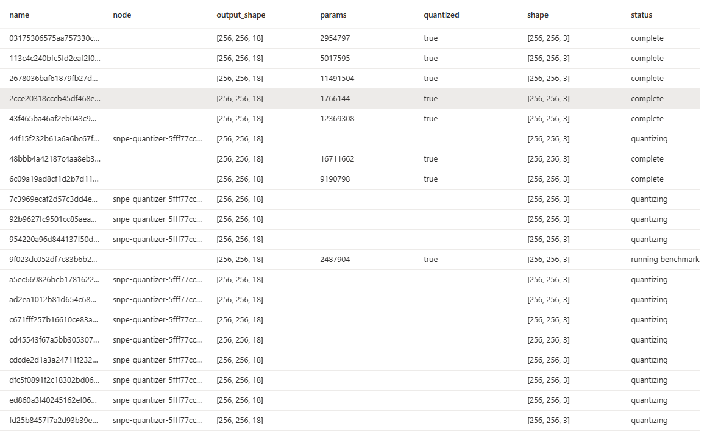

# Readme

This folder contains code that automates the testing of ONNX models across one or more machines that are connected via
USB to Qualcomm 888 boards.

The code is organized into:

1. [SNPE Device Code](snpe/readme.md) that knows how to use the Qualcomm Neural Processing SDK to talk to the device,
convert ONNX models to .dlc, quantize them, and test them on the board using the Android `adb` tool.

1. [Azure Code](azure/readme.md) that talks to a configured Azure storage account for uploading models to test,
downloading them, uploading test results, and keeping an Azure status table that summarizes results of all your
models.

1. [Docker](docker/quantizer/readme.md) scripts for setting up your Azure account and optionally creating a docker image
for running in an Azure Kubernetes cluster to do model quantization using the Qualcomm Neural Processing SDK.
Quantization is time consuming so having an elastic scale speeds things up a lot.

1. [Notebooks](notebook/gallery_performance.md) contains a Jupyter Notebook that can visualize the results from the
Azure "status" table.

It is best if you setup a new Conda Python environment for Python 3.10 with the `requirements.txt` included here using:

```shell
pip install -r requirements.txt
```

The SNPE SDK only works on Linux, so you need a Linux machine with this repo. Then follow additional setup in each of
the above readmes.

## Workflow

The overall workflow looks like this. One or more Linux machines are setup as above and are running `azure/runner.py`
including a Kubernetes cluster setup for quantization (see [docker/quantizer](docker/quantizer) folder).



Each instance of `runner.py` looks for work, and executes it in priority order where the prioritization is defined by
the `find_work_prioritized` function in the runner.  This script is completely restartable, and can distribute the work
across multiple instances of the runner script.  Each instance will pick up where a previous one left off based on what
it finds in your Azure status table. The prioritization maps to the columns of the status table as follows:

1. **macs:** convert to .dlc and post Macs score and `snpe-dlc-viewer` output and do model quantization (runs on Linux) - priority 20
1. **total_inference_avg** run `snpe_bench.py` with quantized model on Qualcomm device DSP - priority 30
1. **f1_onnx** compute f1 from onnxruntime on .onnx model on a 10k test set on Linux - priority 60
1. **f1_1k** compute f1 on quantized .dlc model on Qualcomm device DSP with a 1k test set - priority
is the mean f1 score so that quicker models are prioritized.
1. **f1_1k_f** compute f1 on floating point .dlc model on on Qualcomm device CPU with a 1k test set
   - priority 10 * the mean f1 score so that quicker models are prioritized.
1. **f1_10k** compute f1 on quantized model on a 10k test set - priority = 100 * the mean f1 score
   so that quicker models are prioritized.

Lower number means higher priority job and each machine will run the highest priority work first.

You can override the priority of a specific job by passing a `--proprity` parameter on the `upload.py` script or by
editing the Azure status table and adding a `priority` field to the JSON stored there. You can set any priority number
you want, if you specify priority 0 it will run before anything else which can be handy if you have a cool new model
that you want to bump to the top of the list.

Notice some of the above jobs can run on Linux and do not require Qualcomm device. So in order to maximize throughput on
machines that do have a Qualcomm devices you can allocate other Linux machines with no Qualcomm devices to do the other
work, namely, converting models, quantizing them, and running the `f1_onnx` test.

Folks across your team can use the `azure/upload.py` to submit jobs and let them run, or they can automate that as
shown in the `RemoteAzureBenchmarkEvaluator` in the `search.py` script.

You can use `status.py` to monitor progress or look at the Azure status table.  Various status messages are posted
there so you can see which machine is doing what and is in what stage of the job.

Next you can go to the `notebook` page and get some pretty pictures of your Pareto Curves.

## Portal

When everything is running you will see progress happening in your Azure status table.  Here you see the snpe-quantizer
kubernetes cluster is quantizing a bunch of models while other machines are running the bench mark tests on the Qualcomm
hardware:


