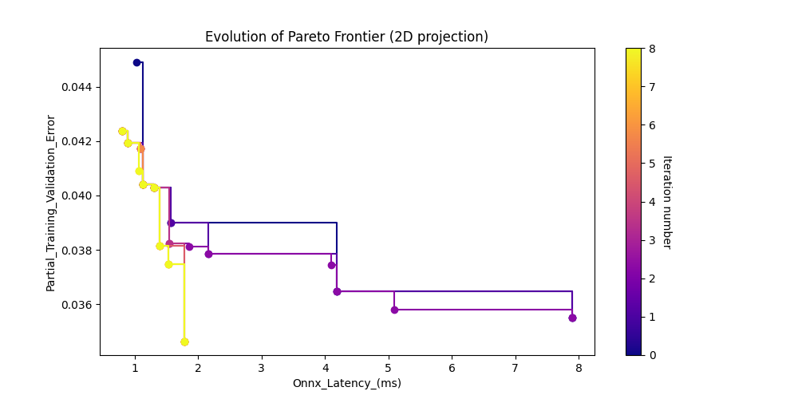
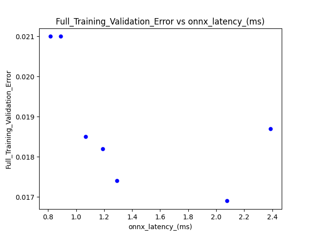

# Facial Landmarks

This project demonstrates the use of Archai to search neural architectures for facial landmarks localization that satisfy the specified objectives, namely, models that minimize the validation error and the inference latency. We follow the general methodology described in the papers [1] and [2], which use a synthetic face dataset and MobileNet V2 as the starting backbone.

## Download the Dataset

The synthetic face dataset can be downloaded from the [FaceSynthetics repository](https://github.com/microsoft/FaceSynthetics).

## Search Space

The search space for this example is based on MobileNetV2 [3], which is a popular architecture for efficient neural networks. The search space includes parameters such as width and depth multipliers, which are commonly used to control the overall size of the models. Additionally, the search space includes parameters such as kernel size "k", expansion ratio "e", and repeatness "r", which allow for fine-grained control of the size of each stage of the model. By searching over this space, Neural Architecture Search is able to find a model structure that is both efficient and effective for the task at hand, while also removing any unnecessary complexity in each stage of the model.
 
## Perform Neural Architecture Search

The default parameters in the `search_config.yaml` file search models with 1/10 of the dataset and 30 epochs. These parameters can be adjusted to suit different needs.

To perform the neural architecture search, run the following command:

```bash
python search.py --config search_config.yaml --output_dir . --data_dir face_synthetics/dataset_100000
```

Note that the paths need to be modified to match what is on your system. 

## Results
At the end of the search job, the following graph is generated:



The search also produces a CSV file (search-results-[date]-[time].csv) containing more details of the search results. An example of this file is included in this repository (search_results.csv).

# Training of Pareto models

To train a particular architecture identified by its ID (e.g., 58626d23) using the entire dataset and more epochs, run the following command:

```bash
torchrun --nproc_per_node=4 train.py --data-path $data_dir --output_dir $output_dir --nas_search_archid $arch_id --search_result_csv $csv_file \
    --train-crop-size 128 --epochs 100 \
    --batch-size 32 --lr 0.001 --opt adamw --lr-scheduler steplr --lr-step-size 100 --lr-gamma 0.5 -wd 0.00001
```

Note that this command assumes that there are 4 GPUs available.

You can also use the script train_candidate_models.py to train all models on the Pareto frontier. Note the parameters in train_candidate_models.py need to be modified to match what is on your system.

To train all models on the Pareto frontier, run the following command:

```bash
python train_candidate_models.py
```

Note that this script assumes that the search results CSV file (search_results.csv) is located in the same directory as the script. If the CSV file is located elsewhere, you can modify the csv_file variable in the script to point to the correct location.

The trained models will be saved in the models directory. You can modify the output_dir variable in the script to specify a different output directory if desired.

## Results
The training using the parameters in train_candidate_models.py produces another CSV file (search_results_with_full_validation_error.csv) with validation error data added from the training. The following graph is produced with such data:


## References

[1] "3D Face Reconstruction with Dense Landmarks", Microsoft Research, 2018. https://www.microsoft.com/en-us/research/publication/3d-face-reconstruction-with-dense-landmarks/

[2] "FaceSynthetics: A High-Fidelity 3D Face Dataset for Benchmarking Face Reconstruction Algorithms", Microsoft Research, 2021. https://www.microsoft.com/en-us/research/uploads/prod/2021/10/ICCV_2021_FaceSynthetics.pdf

[3] "MobileNetV2: Inverted Residuals and Linear Bottlenecks", Mark Sandler etal, 2018, https://arxiv.org/abs/1801.04381
