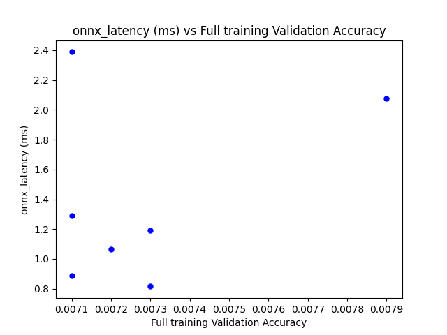

# Download the dataset
From: https://github.com/microsoft/FaceSynthetics

# Perform Neural architecture search

# Command line to run a training job
data_dir=/data/public_face_synthetics/dataset_100000
output_dir=/tmp
arch_id=58626d23
csv=search_results.csv
time torchrun --nproc_per_node=4 train.py --data-path $data_dir --output_dir $output_dir --nas_search_archid $arch_id --search_result_csv $csv \\
    --train-crop-size 128 --epochs 100 \\
    --batch-size 32 --lr 0.001 --opt adamw --lr-scheduler steplr --lr-step-size 100 --lr-gamma 0.5 -wd 0.00001 

# Full training of Pareto models
Modify the parameters in train_candidate_models.py to match what is on your system.  
## Command line 
    python train_candidate_models.py

## Result

