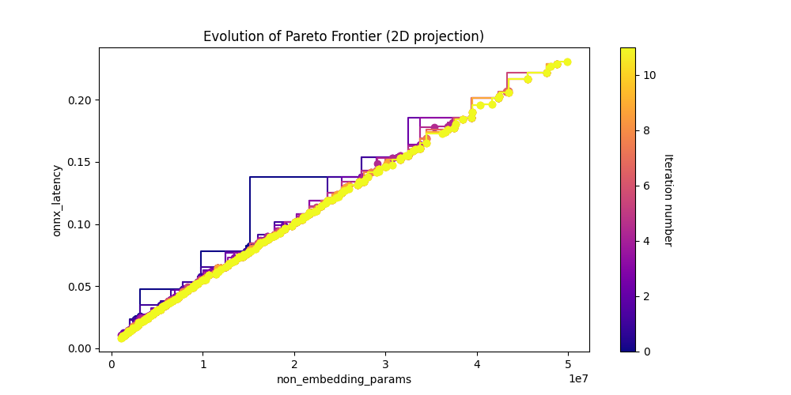
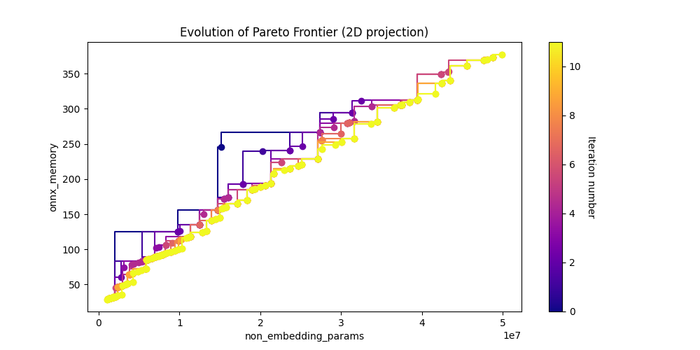
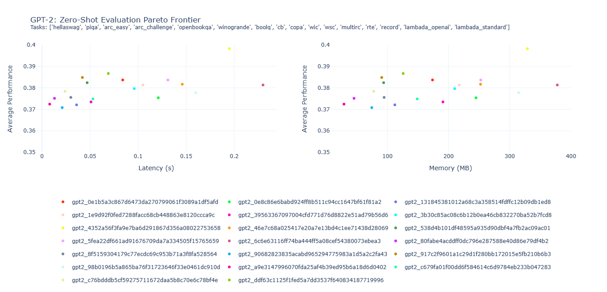

# Text Generation

At Archai, we recognize the significance of discovering the optimal neural architecture to attain the highest performance in text generation. For this purpose, we have created an advanced neural architecture search method known as the Lightweight Transformer Search (LTS). This innovative method enables us to identify the most optimal architectures that exist on the Pareto Frontier, where trade-offs are made between several objectives, such as latency and memory usage.

## Model Gallery

We utilized GPT-2 as our base model and applied LTS on top of it to find the best performing architectures given a set of constraints. The following table showcases the results of our search:

| Model | Non-Embedding Parameters (M) | Latency (s) | Memory (MB) |
| - | - | - | - |
[gpt2_a9e3147996070fda25af4b39ed95b6a18d6d0402](https://huggingface.co/microsoft/lts-gpt2-sm/tree/main/gpt2_0e1b5a3c867d6473da270799061f3089a1df5afd) | 1.06 | 0.008 | 29.06
[gpt2_80fabe4acddff0dc796e287588e40d86e79df4b2](https://huggingface.co/microsoft/lts-gpt2-sm/tree/main/gpt2_80fabe4acddff0dc796e287588e40d86e79df4b2) | 2.08 | 0.013 | 45.46
[gpt2_90682823835acabd965294775983a1d5a2c2fa43](https://huggingface.co/microsoft/lts-gpt2-sm/tree/main/gpt2_90682823835acabd965294775983a1d5a2c2fa43) | 3.13 | 0.021 | 74.50
[gpt2_c76bdddb5cf59275711672daa5b8c70e6c78bf4e](https://huggingface.co/microsoft/lts-gpt2-sm/tree/main/gpt2_c76bdddb5cf59275711672daa5b8c70e6c78bf4e) | 3.95 | 0.024 | 77.62
[gpt2_8f5159304179c77ecdc69c953b71a3f8fa528564](https://huggingface.co/microsoft/lts-gpt2-sm/tree/main/gpt2_8f5159304179c77ecdc69c953b71a3f8fa528564) | 5.13 | 0.030 | 94.64
[gpt2_131845381012a68c3a358514fdffc12b09db1ed8](https://huggingface.co/microsoft/lts-gpt2-sm/tree/main/gpt2_131845381012a68c3a358514fdffc12b09db1ed8) | 6.44 | 0.036 | 112.16
[gpt2_917c2f9601a1c29d1f280bb172015e5fb210b6b3](https://huggingface.co/microsoft/lts-gpt2-sm/tree/main/gpt2_917c2f9601a1c29d1f280bb172015e5fb210b6b3) | 7.41 | 0.042 | 90.76
[gpt2_538d4b101df48595a935d90dbf4a7fb2ac09ac01](https://huggingface.co/microsoft/lts-gpt2-sm/tree/main/gpt2_538d4b101df48595a935d90dbf4a7fb2ac09ac01) | 8.23 | 0.047 | 93.88
[gpt2_c679fa01f00dd6f584614c6d9784eb233b047283](https://huggingface.co/microsoft/lts-gpt2-sm/tree/main/gpt2_c679fa01f00dd6f584614c6d9784eb233b047283) | 9.46 | 0.053 | 148.71
[gpt2_39563367097004cfd771d76d8822e51ad79b56d6](https://huggingface.co/microsoft/lts-gpt2-sm/tree/main/gpt2_39563367097004cfd771d76d8822e51ad79b56d6) | 10.65 | 0.051 | 190.77
[gpt2_ddf63c1125f1fed5a7dd3537f640834187719996](https://huggingface.co/microsoft/lts-gpt2-sm/tree/main/gpt2_ddf63c1125f1fed5a7dd3537f640834187719996) | 13.32 | 0.069 | 125.78
[gpt2_0e1b5a3c867d6473da270799061f3089a1df5afd](https://huggingface.co/microsoft/lts-gpt2-sm/tree/main/gpt2_0e1b5a3c867d6473da270799061f3089a1df5afd) | 16.04 | 0.084 | 173.74
[gpt2_3b30c85ac08c6b12b0ea46cb832270ba52b7fcd8](https://huggingface.co/microsoft/lts-gpt2-sm/tree/main/gpt2_3b30c85ac08c6b12b0ea46cb832270ba52b7fcd8) | 18.97 | 0.096 | 209.94
[gpt2_1e9d92f0fed7288facc68cb448863e8120ccca9c](https://huggingface.co/microsoft/lts-gpt2-sm/tree/main/gpt2_1e9d92f0fed7288facc68cb448863e8120ccca9c) | 20.96 | 0.105 | 217.50
[gpt2_0e8c86e6babd924ff8b511c94cc1647bf61f81a2](https://huggingface.co/microsoft/lts-gpt2-sm/tree/main/gpt2_0e8c86e6babd924ff8b511c94cc1647bf61f81a2) | 24.83 | 0.121 | 244.77
[gpt2_5fea22df661ad91676709da7a334505f15765659](https://huggingface.co/microsoft/lts-gpt2-sm/tree/main/gpt2_5fea22df661ad91676709da7a334505f15765659) | 26.89 | 0.131 | 252.65
[gpt2_46e7c68a025417e20a7e13bd4c1ee71438d28069](https://huggingface.co/microsoft/lts-gpt2-sm/tree/main/gpt2_46e7c68a025417e20a7e13bd4c1ee71438d28069) | 30.07 | 0.146 | 252.23
[gpt2_98b0196b5a865ba76f31723646f33e0461dc910d](https://huggingface.co/microsoft/lts-gpt2-sm/tree/main/gpt2_98b0196b5a865ba76f31723646f33e0461dc910d) | 33.24 | 0.160 | 314.39
[gpt2_4352a56f3fa9e7ba6d291867d356a08022753658](https://huggingface.co/microsoft/lts-gpt2-sm/tree/main/gpt2_4352a56f3fa9e7ba6d291867d356a08022753658) | 40.34 | 0.195 | 328.88
[gpt2_6c6e63116ff74ba444ff5a08cef54380073ebea3](https://huggingface.co/microsoft/lts-gpt2-sm/tree/main/gpt2_6c6e63116ff74ba444ff5a08cef54380073ebea3) | 49.85 | 0.230 | 377.68

For a straightforward usage with the `transformers` package, please refer to [microsoft/lts-gpt2-sm](https://huggingface.co/microsoft/lts-gpt2-sm) on the Hugging Face Hub.

## Searching for Pareto-optimal Architectures

We ran LTS for a total of 10 generations and discovered multiple architectures that perform well with regards to non-embedding parameters, latency, and memory. To reproduce the search, the following command can be used:

```python
python search.py -h
```

*The default arguments provided by the script were used in this task.*

### Results

The best-performing architectures with respect to non-embedding parameters and ONNX-based latency are depicted by the points in the bottom-left corner of the plot:



The best-performing architectures with respect to non-embedding parameters and ONNX-based memory are shown by the points in the bottom-left corner of the plot:



## Training the Architectures

Once the Pareto-optimal architectures have been found (located in the `models` folder), they can be trained using the following script:

```python
python train.py -h
```

*The default arguments provided by the script were used in this task. The training dataset consisted of 7.8 billion tokens from a pre-encoded version of ThePile.*

### Results

After pre-training the architectures, we performed a zero-shot evaluation over 16 tasks, and created two Pareto frontiers between the average performance (across all tasks) and ONNX-based metrics (latency and memory).



It is worth noting that the model labeled *gpt2_4352a56f3fa9e7ba6d291867d356a08022753658* (represented by the "yellow" dot) achieved the highest average performance with lower latency and memory usage than *gpt2_6c6e63116ff74ba444ff5a08cef54380073ebea3*, despite having 20% less parameters.

Furthermore, *gpt2_ddf63c1125f1fed5a7dd3537f640834187719996* (represented by the "medium green" dot) used only 13.32M non-embedding parameters, 0.069s of latency, and 125.78MB of memory, yet it attained an average performance of 0.3867. This level of performance was only 2.89% lower than that of the highest-performing model ("yellow" dot), but it utilized roughly one-third of the non-embedding parameters, latency, and memory.

## Generating Text with Pre-Trained Architectures

With our pre-trained architectures, text can be generated with ease using just a few lines of code. Simply use one of the models from our Model Gallery and start generating text:

```python
python generate_text.py "microsoft/lts-gpt2-sm" "# Halo Infinite Review" --pre_trained_model_subfolder "gpt2_ddf63c1125f1fed5a7dd3537f640834187719996"
```
